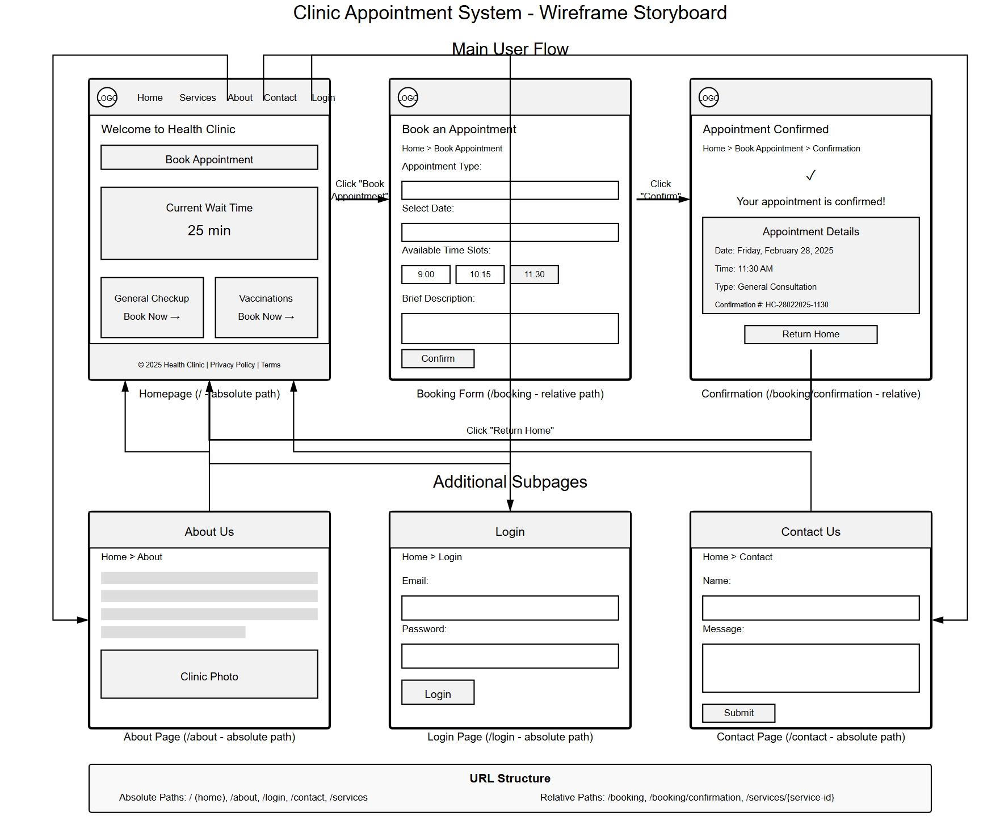
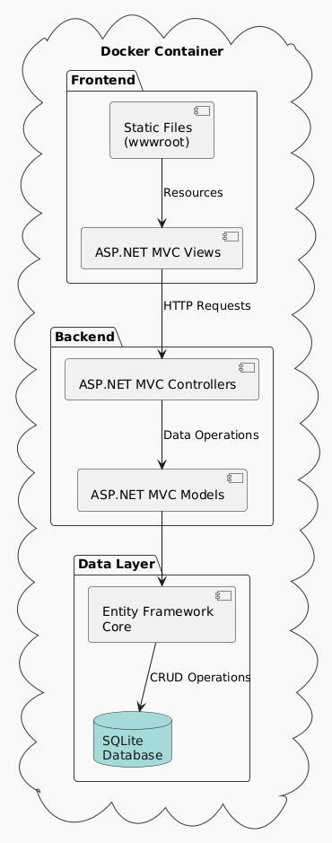
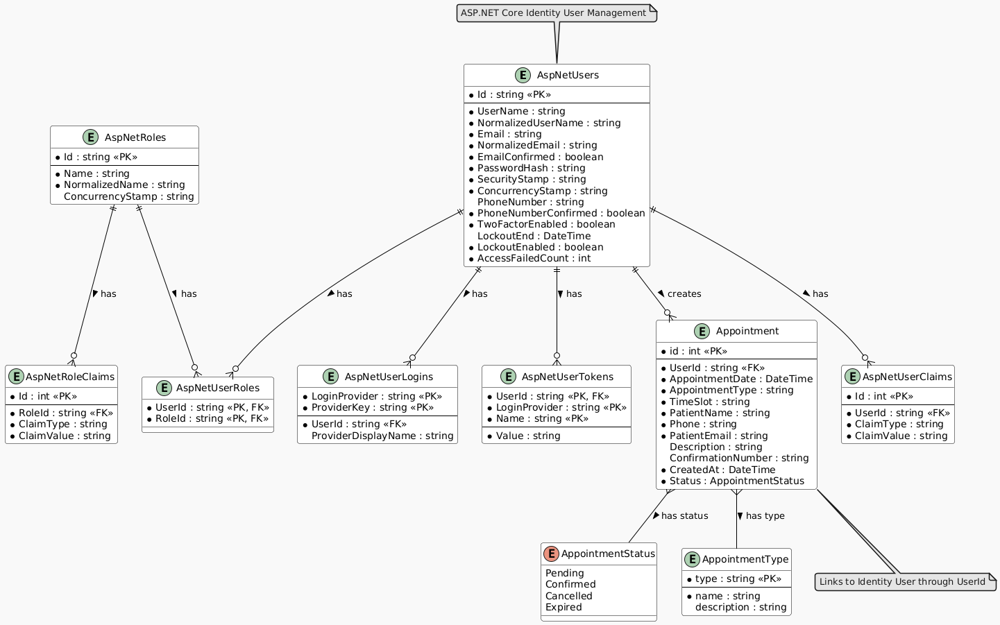

# Clinic Appointment System

A modern, containerized web application for managing clinic appointments built with ASP.NET Core MVC and SQLite.

## 🚀 Features

- Appointment scheduling and management
- User-friendly interface
- Containerized deployment with Docker
- Secure data storage with SQLite
- Built with modern ASP.NET Core MVC architecture
## 📋 Prerequisites

- .NET 8.0 SDK
- Visual Studio 2022
- Docker Desktop (optional)


## 🚀 Getting Started

1. Clone the repository:
   ```bash
   git clone [repository-url]
   cd ClinicAppointment
   ```
2. Open Visual Studio 2022

2. Build and run:

   1. Open `ClinicAppointment.sln` in Visual Studio
   2. Press F5 or click the "Start Debugging" button to run the application.

3. The application will automatically pop up or based on your configuration you can access the application at `https://localhost:8081`(Docker), `https://localhost:7145`(https) or `https://localhost:44331`(IIS).

## 🛠️ Technologies Used

- ASP.NET Core MVC
- Entity Framework Core
- SQLite Database
- Docker
- HTML/CSS/JavaScript (wwwroot)


## 📁 Project Structure

```
ClinicAppointment/
├── Controllers/         # MVC Controllers
├── Models/             # Data models and business logic
├── Views/              # MVC Views
├── Services/           # Business services
├── Data/              # Data access layer
├── wwwroot/           # Static files (CSS, JS, images)
├── Dockerfile         # Docker configuration
└── Program.cs         # Application entry point
```

## 🔧 Wireframe

## 🏗️ Architecture

The application follows a clean MVC architecture:

- **Frontend**: ASP.NET MVC Views and Bootstrap (HTML/CSS/JS)
- **Backend**: ASP.NET MVC Controllers and Models
- **Data Layer**: Entity Framework Core with SQLite database

All components are containerized using Docker for easy deployment and scalability.

## ER diagram



## 🐳 Docker Support

The application includes Docker support for containerized deployment:
- Multi-stage build for optimized container size
- Environment-specific configurations
- Ready for cloud deployment

## Contributions
|Name|Role|Responsibilties|
|--|--|--|
|Shijie Yin|Architect| <li>Responsible for designing the architecture and create overall structure.</li> <li>Fix bugs and technical issues.</li> <li>Improve accessability of application.</li>|
|Yashvi Patel|Developer||
|Muinat Usman|Product Manager|<li>Responsible for designing the Wireframe and User Story.</li> <li>Also ensured that all the features were included and functional.</li>|